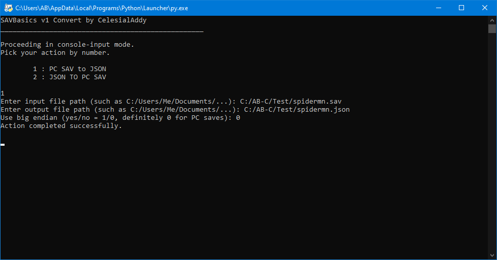
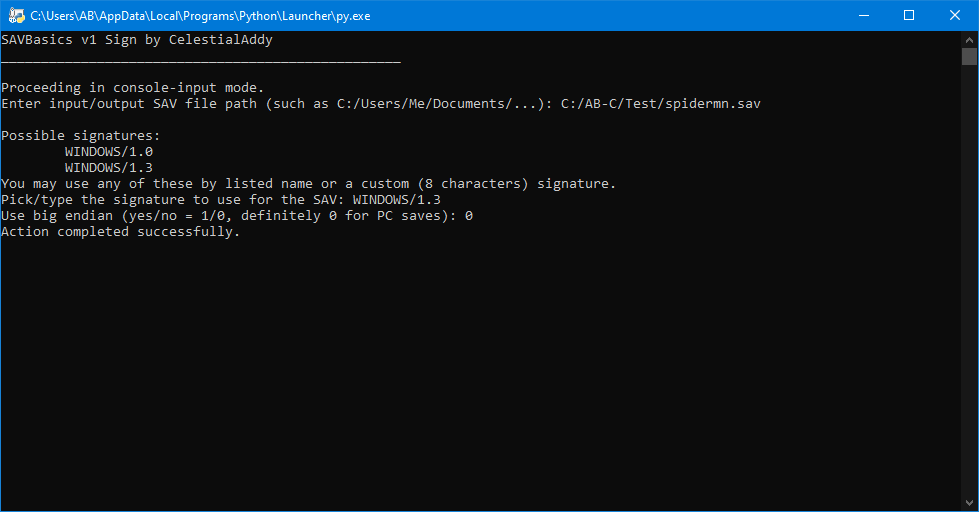
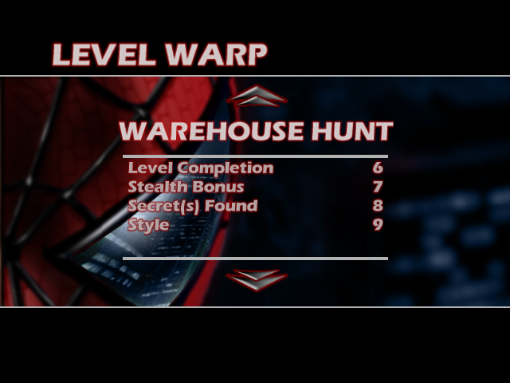
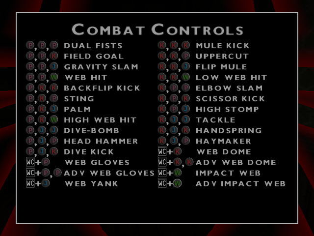
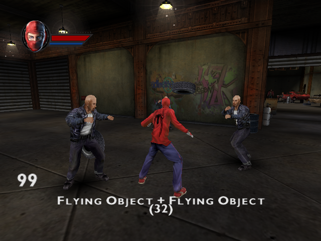
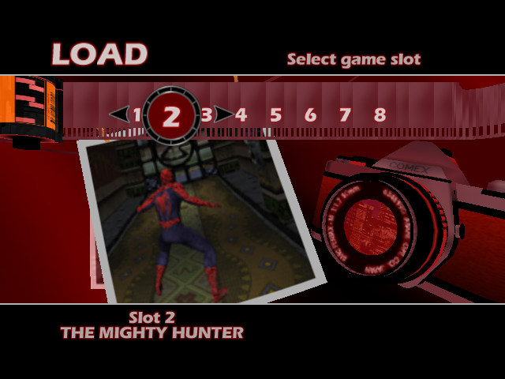

# Examples

## Utility screenshots



## In-game screenshots






## Example JSON
```
	"Slot01": {
		"Baseline": {
			"Difficulty": 4,
			"ContinueLevel": 1,
			"UnlocksLevelUNKNOWN": 25,
			"UnlocksLevelEASY": 25,
			"UnlocksLevelNORMAL": 25,
			"UnlocksLevelHERO": 25,
			"UnlocksLevelSUPERHERO": 25,
			"SecretStoreToggles": -16512
		},
		"CombatControls": {
			"FieldGoal_PPK": true,
			"GravitySlam_PPJ": true,
			"WebHit_PPW": true,
			"BackflipKick_PKK": true,
			"Sting_PKP": true,
			"Palm_PKJ": true,
			"HighWebHit_PKW": true,
			"DiveBomb_PJJ": true,
			"HeadHammer_PJP": true,
			"DiveKick_PJK": true,
			"Uppercut_KKP": true,
			"FlipMule_KKJ": true,
			"LowWebHit_KKW": true,
			"ScissorKick_KPK": true,
			"HighStomp_KPJ": true,
			"Tackle_KJJ": true,
			"Handspring_KJK": true,
			"Haymaker_KJP": true,
			"AdvWebDome_WCKK": true,
			"AdvWebGloves_WCPP": true,
			"AdvImpactWeb_WCW": true
		},
		"TrainingBestTimes": {
			"BasicAirCombat": [
				1119092736,
				1123024896,
				1126498304
			],
			"BasicSwingTraining": [
				1121058816,
				1124532224,
				1127481344
			],
			"AdvancedSwingTraining": [
				1123024896,
				1126170624,
				1128792064
			],
			"ExpertSwingTraining": [
				1119092736,
				1123024896,
				1126498304
			],
			"BasicZipTraining": [
				1121058816,
				1125515264,
				1127481344
			],
			"AdvancedZipTraining": [
				1123024896,
				1126498304,
				1130430464
			],
			"ExpertZipTraining": [
				1117126656,
				1123024896,
				1126498304
			],
			"SwingRings": [
				1125515264,
				1127481344,
				1129447424
			],
			"SwingPlatforms": [
				1125515264,
				1128464384,
				1131413504
			],
			"ObstacleCourse": [
				1114636288,
				1120403456,
				1125515264
			]
		},
		"LevelBonusPoints": {
			"SearchForJustice": {
				"LevelCompletion": 1,
				"Perfect": 2,
				"Combat": 3,
				"SecretsFound": 4,
				"Style": 5
			},
			"WarehouseHunt": {
				"LevelCompletion": 6,
				"StealthBonus": 7,
				"SecretsFound": 8,
				"Style": 9
			},
			"BirthOfAHero": {
				"LevelCompletion": 10,
				"Time": 11,
				"SecretsFound": 12,
				"Style": 13
			},
			"OscorpsGambit": {
				"LevelCompletion": 14,
				"Perfect": 15,
				"DefeatedHKs": 16,
				"Style": 17
			},
			"TheSubwayStation": {
				"LevelCompletion": 18,
				"Time": 19,
				"Perfect": 20,
				"Style": 21
			},
			"ChaseThroughTheSewer": {
				"LevelCompletion": 22,
				"Time": 23,
				"SecretsFound": 24,
				"Combat": 25,
				"Style": 26
			},
			"ShowdownWithShocker": {
				"LevelCompletion": 27,
				"Time": 28,
				"Perfect": 29,
				"SecretsFound": 30,
				"Style": 31
			},
			"VulturesLair": {
				"LevelCompletion": 32,
				"Time": 33,
				"Perfect": 34
			},
			"VultureEscapes": {
				"LevelCompletion": 35,
				"Time": 36,
				"Perfect": 37,
				"VultureProximity": 38
			},
			"AirDuelWithVulture": {
				"LevelCompletion": 39,
				"Time": 40,
				"Perfect": 41,
				"Style": 42
			},
			"Corralled": {
				"LevelCompletion": 43,
				"SecretsFound": 44,
				"ProtectedScorpion": 45,
				"Style": 46
			},
			"ScorpionsRampage": {
				"LevelCompletion": 47,
				"Style": 49,
				"NoPickupsUsed": 48
			},
			"CoupDEtat": {
				"LevelCompletion": 50,
				"Time": 51,
				"Perfect": 52,
				"Style": 53
			},
			"TheOffer": {
				"LevelCompletion": 54,
				"Time": 55,
				"Perfect": 56,
				"Style": 57,
				"RideGoblin": 58
			},
			"RaceAgainstTime": {
				"LevelCompletion": 59,
				"Time": 60,
				"Perfect": 61
			},
			"TheRazorsEdge": {
				"LevelCompletion": 62,
				"RBatsDestroyed": 63,
				"RemainingHealth": 64,
				"PickupsUsed": 65,
				"Style": 66
			},
			"BreakingAndEntering": {
				"LevelCompletion": 67,
				"Time": 68,
				"Perfect": 69,
				"SecretsFound": 70,
				"StealthBonus": 71
			},
			"ChemicalChaos": {
				"LevelCompletion": 72,
				"Time": 73,
				"Perfect": 74
			},
			"OscorpsUltimateWeapon": {
				"LevelCompletion": 75,
				"Time": 76,
				"Perfect": 77,
				"Style": 78
			},
			"EscapeFromOscorp": {
				"LevelCompletion": 79,
				"Perfect": 80,
				"SupersoldiersKilled": 81,
				"Style": 82
			},
			"MaryJaneKidnapped": {
				"LevelCompletion": 83,
				"Perfect": 84
			},
			"Other": {
				"UnknownBonus01": 0,
				"UnknownBonus02": 0,
				"UnknownBonus03": 0,
				"UnknownBonus04": 0,
				"UnknownBonus05": 0,
				"UnknownBonus06": 0,
				"UnknownBonus07": 0,
				"UnknownBonus08": 0,
				"UnknownBonus09": 0,
				"UnknownBonus10": 0,
				"UnknownBonus11": 0,
				"UnknownBonus12": 0,
				"UnknownBonus13": 0,
				"UnknownBonus14": 0,
				"UnknownBonus15": 0,
				"UnknownBonus16": 0,
				"UnknownBonus17": 0,
				"UnknownBonus18": 0,
				"UnknownBonus19": 0,
				"UnknownBonus20": 0
			}
		},
		"Options": {
			"UnknownVolume": 1059481190,
			"MusicVolume": 1059481190,
			"SFXVolume": 1059481190,
			"VoiceVolume": 1065353216,
			"MovieVolume": 1061158912,
			"CameraMode": 1,
			"InvertCameraLook": 0,
			"ControllerVibration": 0,
			"SwapJumpAndWebInputs": false,
			"SwapZipAndSwingInputs": false,
			"ControllerMovementTweak": false,
			"MovementToggles": 1063675494,
			"TankControls": false,
			"ShowStylePoints": 1
		},
		"Miscellaneous": {
			"MainMenuState": 1,
			"UnknownString01": [
				72,
				67
			],
			"UnknownString02": [
				102,
				97,
				107,
				101,
				104,
				101,
				114,
				111
			]
		}
	},
```
  
----------  
  